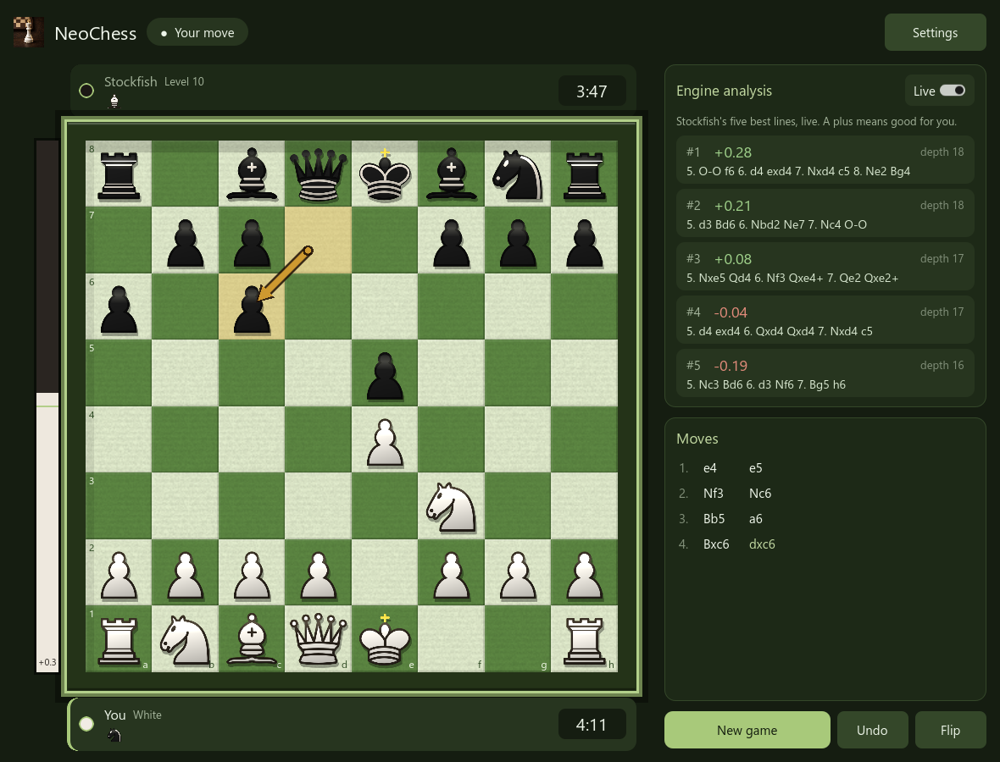
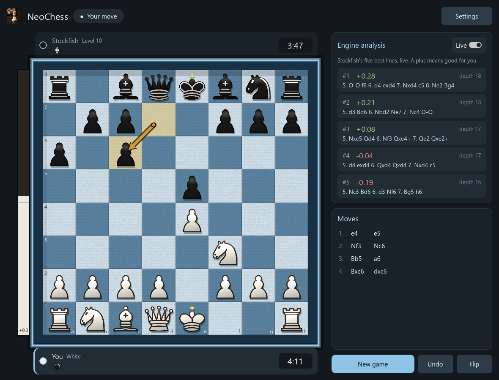
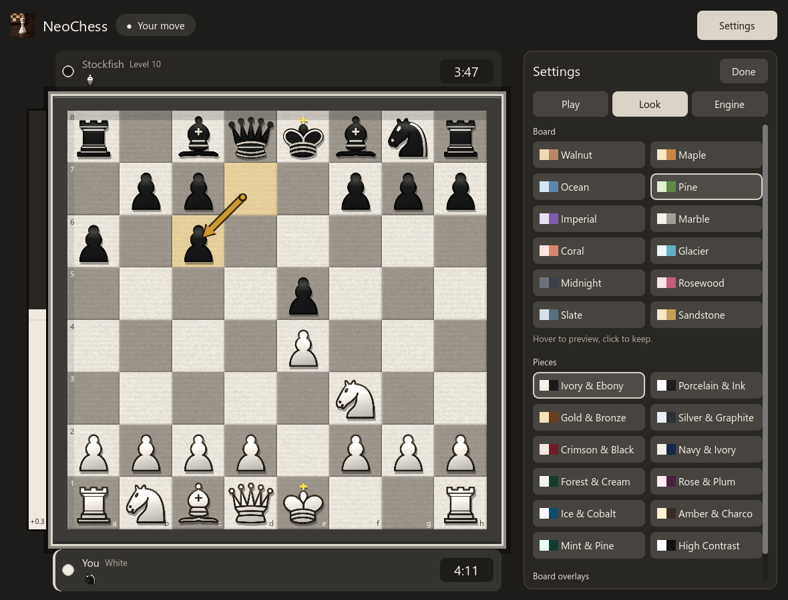
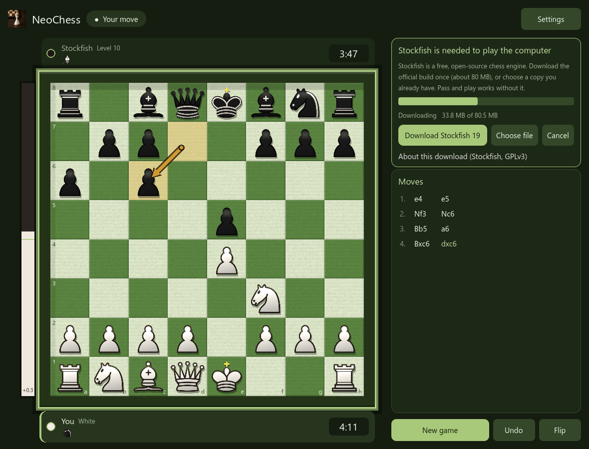

# NeoChess

A polished desktop chess game for Windows, built with Godot 4.7. Play against
[Stockfish](https://stockfishchess.org), watch its five best lines update live
while it thinks, or play a friend on the same computer.



## Features

- **Full chess rules**: castling, en passant, promotion, check, checkmate,
  stalemate, threefold repetition, the fifty-move rule and insufficient material.
  The move generator is checked against the standard perft positions.
- **Play Stockfish 19** at any strength: levels 0 to 20, or cap it at an Elo
  rating from 1320 to 3190.
- **Live engine analysis**: Stockfish's top five lines stream in as they are
  found, with score, depth and the full variation. A plus always means good for
  *you*, whichever colour you play.
- **Eval bar**, player strips with captured pieces and material lead, a move
  list, undo, and a board you can flip.
- **Two ways to think**: a fixed time per move, or a real chess clock (1 to 30
  minutes per side) where Stockfish decides how long each move needs.
- **12 board themes and 12 piece sets.** Hover to preview, click to keep. The
  whole app takes its colours from the board you pick.
- **Pass and play** for two people on one computer. This needs no engine.
- Smooth piece movement, a last-move arrow, legal-move hints and keyboard
  shortcuts.

| Look and feel | Settings |
| --- | --- |
|  |  |

## Getting started

### Play

1. Download the latest release zip and unpack it anywhere.
2. Run `NeoChess.exe`.

Release builds include Stockfish next to the exe. If you have only the exe, or
you build from source, NeoChess detects that the engine is missing and offers a
**Download Stockfish** button (see [The Stockfish engine](#the-stockfish-engine)).

**Requirements:** Windows 10 or 11 (64-bit) with Windows PowerShell 5.1, which
is built in. NeoChess uses it to talk to the engine. An internet connection is
only needed for the one-time engine download.

### Controls

| Action | Mouse | Key |
| --- | --- | --- |
| Move a piece | Click it, then click where it goes | |
| New game | **New game** | `N` |
| Take back a move | **Undo** (in a game against Stockfish it takes back your move and the reply) | `U` |
| Flip the board | **Flip** | `F` |
| Open or close settings | **Settings** / **Done** | `S` |
| Cancel a selection, close settings | | `Esc` |

### Settings

- **Play**: opponent (Stockfish or pass and play), your colour, strength, and
  how long Stockfish thinks (fixed per move, or a chess clock).
- **Look**: board theme, piece set and the last-move arrow.
- **Engine**: CPU threads, hash memory, move overhead and the engine file.

Your choices are saved automatically to the Godot user folder
(`%APPDATA%\Godot\app_userdata\NeoChess`).

## The Stockfish engine

NeoChess does not contain Stockfish in its source code. Stockfish is licensed
under the GPLv3, so the repository keeps it out and NeoChess finds or fetches
it at run time. It looks for `stockfish.exe` in this order:

1. The path saved in **Settings, Engine, Engine file**, if the file exists.
2. `bin\stockfish.exe` inside the project (development).
3. `stockfish.exe` or `bin\stockfish.exe` next to `NeoChess.exe`.
4. The copy NeoChess downloaded for you:
   `%APPDATA%\Godot\app_userdata\NeoChess\engine\stockfish.exe`.

When none of these exist and you are playing Stockfish, a card appears in the
sidebar:



- **Download Stockfish 19** fetches the official
  [`stockfish-windows-x86-64-universal.zip`](https://github.com/official-stockfish/Stockfish/releases/tag/sf_19)
  from the Stockfish GitHub release (about 78 MB), unpacks the engine into your
  user folder, checks that it starts, and selects it. You can cancel while it
  downloads. The universal build picks the fastest instruction set your CPU
  supports.
- **Choose file** lets you point at a Stockfish you already have, for example a
  newer build from [stockfishchess.org/download](https://stockfishchess.org/download/).
- **Pass and play** works without any engine.

The same download button lives under **Settings, Engine**. Nothing is sent to
anyone except the request to GitHub, and nothing is installed outside the
NeoChess user folder.

## Building from source

You need [Godot 4.7.2](https://godotengine.org/download) (the standard build,
not .NET) and, to export, its Windows export templates.

```powershell
git clone <this repository>
cd NeoChess

# Optional: get Stockfish into bin/ so the game has an engine straight away.
./dev/fetch_stockfish.ps1

# Run from the editor
godot --path . --editor
# or run the game directly
godot --path .
```

You can skip the fetch step and use the in-app download instead.

### Tests

```powershell
./tests/run_tests.ps1                  # everything
./tests/run_tests.ps1 -Filter uci      # one file
./tests/run_tests.ps1 -VerboseChecks   # list every passing check
```

The script finds Godot from `-Godot <path>`, then `$env:GODOT`, then `PATH`.

| File | What it covers |
| --- | --- |
| `test_rules.gd` | Perft against the standard test positions, castling, en passant, pins, mate |
| `test_chess_extra.gd` | FEN, promotion, draws, repetition, castling rules, SAN, cloning |
| `test_uci.gd` | UCI command building, option clamping, parsing Stockfish output |
| `test_engine_setup.gd` | Download helpers, archive extraction, error messages (no network) |
| `test_appearance.gd` | Every theme is complete and every palette meets contrast targets |
| `test_smoke.gd` | Loads the real scene and plays, undoes and restarts a game |
| `test_engine.gd` | Real searches through Stockfish; skipped if no engine is installed |

### Release build

```powershell
./dev/build.ps1 -Zip              # bundles Stockfish, writes dist/NeoChess-windows.zip
./dev/build.ps1 -NoEngine         # a small build that offers the in-app download
```

If you ship the engine, keep `Copying.txt`, `AUTHORS` and `STOCKFISH.txt` beside
it. `build.ps1` does this for you.

## How it works

```text
scenes/main.tscn        the single scene
scripts/main.gd         layout, game flow, settings, engine control
scripts/chess_game.gd   rules: moves, check, FEN, SAN, draws, perft
scripts/board_view.gd   board drawing, animation, eval bar, last-move arrow
scripts/stockfish_uci.gd UCI commands and parsing of engine output
scripts/engine_setup.gd  engine lookup, archive extraction, verification
scripts/engine_installer.gd  the download itself
scripts/appearance.gd   board and piece themes, app palette from a board
scripts/piece_art.gd    recolours the piece outlines per piece set
bin/run_stockfish.ps1   small launcher that runs one search and streams output
dev/                    fetch and build scripts
tests/                  headless test suite
```

Godot cannot read a child process's output while it is still running, so each
search goes through `bin/run_stockfish.ps1`. It starts Stockfish, sends the UCI
commands, and writes every `info` line to a file as it arrives. NeoChess reads
that file while the search runs, which is how the five lines update live. The
helper compiles a tiny C# class the first time it runs; antivirus tools very
occasionally comment on that, and it is safe to allow.

## Troubleshooting

- **"Stockfish was not found"**: use the Download button, or **Choose file**.
- **The download fails**: you will see the reason (offline, blocked, disk full).
  Try again, or download the zip from the release page yourself and choose the
  `.exe` inside it.
- **The engine seems slow or loses time on a clock**: raise *Move overhead*
  under Settings, Engine.
- **No live lines**: switch the *Live* toggle on in the Engine analysis card.

## Credits and licenses

- NeoChess source code: [MIT](LICENSE).
- [Stockfish](https://stockfishchess.org): GNU GPL v3, by the Stockfish
  developers. Downloaded or bundled as a separate program, never linked in.
- Chess piece drawings: the Cburnett set by Colin M. L. Burnett, triple-licensed
  under the GFDL, BSD and GPL. NeoChess recolours the outlines at run time. See
  [`pieces/CREDITS.txt`](pieces/CREDITS.txt).
- Built with [Godot Engine](https://godotengine.org) (MIT).
