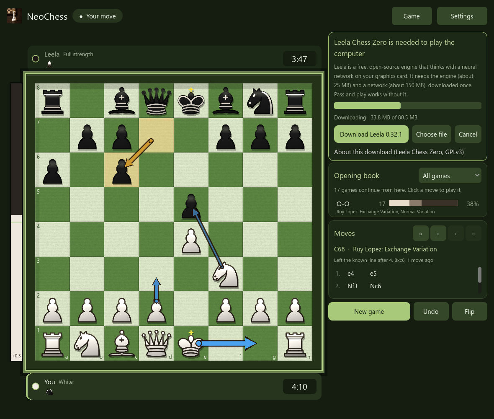

# The engines

NeoChess plays and analyses with [Stockfish](https://stockfishchess.org), the
strongest open-source chess engine, which runs on the processor. It can also use
[Leela Chess Zero](https://lczero.org), a neural-network engine that runs on the
graphics card. Either one runs as a separate program and talks to NeoChess over
the standard UCI protocol. Pick one in **Settings, Engine, Engine**.

- [Finding the engine](#finding-the-engine)
- [Download card](#download-card)
- [Leela Chess Zero on the graphics card](#leela-chess-zero-on-the-graphics-card)
- [Licensing](#licensing)
- [The UciEngine API](#the-uciengine-api)
- [Linux and macOS](#linux-and-macos)

## Finding the engine

Release zips include `stockfish.exe` next to `NeoChess.exe`, so nothing needs to
be set up. Otherwise NeoChess looks for `stockfish.exe` (`stockfish` on Linux and
macOS) in this order:

1. The path saved in **Settings, Engine, Engine file**, if the file exists.
2. `bin\stockfish.exe` inside the project (development).
3. `stockfish.exe` or `bin\stockfish.exe` next to `NeoChess.exe`.
4. The copy NeoChess downloaded for you:
   `%APPDATA%\Godot\app_userdata\NeoChess\engine\stockfish.exe`.
5. On Linux and macOS only: a Stockfish installed on the system, such as
   `/usr/games/stockfish`, `/usr/bin/stockfish` or `/opt/homebrew/bin/stockfish`.

## Download card

When none of these exist and you play Stockfish, a card appears in the sidebar:


- **Download Stockfish 19** fetches the official build for your system, for
  example [`stockfish-windows-x86-64-universal.zip`](https://github.com/official-stockfish/Stockfish/releases/tag/sf_19)
  from the Stockfish GitHub release (about 80 MB). It unpacks the engine into
  your user folder, checks that it starts, and selects it. You can cancel while it
  downloads. The universal build picks the fastest instruction set your CPU
  supports.
- **Choose file** lets you point at a Stockfish you already have, for example a
  newer build from [stockfishchess.org/download](https://stockfishchess.org/download/).
- **Pass and play** works without any engine.

The same download button lives under **Settings, Engine**. Nothing is sent to
anyone except the request to GitHub, and nothing is installed outside the
NeoChess user folder.

## Leela Chess Zero on the graphics card

Stockfish searches millions of positions a second on the processor. Leela
([lc0](https://github.com/LeelaChessZero/lc0)) judges far fewer positions with a
neural network, and that network runs on the graphics card. Choose **Leela Chess
Zero (graphics card)** under **Settings, Engine, Engine** and the sidebar shows a
download card:



- **Download Leela 0.32.1** fetches two things, once, into your user folder
  (`%APPDATA%\Godot\app_userdata\NeoChess\engine\leela`):
  1. the Windows **DirectML** build of lc0 from its
     [GitHub release](https://github.com/LeelaChessZero/lc0/releases/tag/v0.32.1)
     (about 25 MB). DirectML works with any DirectX 12 graphics card (NVIDIA, AMD
     or Intel) and needs no CUDA install;
  2. one neural network, `t1-512x15x8h-distilled-swa-3395000`, from the Leela
     Chess Zero server (about 143 MB). It is a strong medium-size network that
     suits a mid-range or better card.
  A cancelled download continues with the missing part next time. NeoChess then
  starts lc0 with `Backend=onnx-dml` and the downloaded network.
- **Choose file** uses an lc0 you already have, for example a CUDA build or one
  from a Linux package. NeoChess then leaves the backend and network to that
  copy's own configuration (put the network file next to it or set it in its
  `lc0.config`).
- Leela has **no levels**: it always plays at full strength, so the level, Elo
  cap and hash settings are unavailable while it is chosen. Use Stockfish to play
  a weaker opponent. Analysis, the three best-move arrows, review and the
  library work the same with either engine. Switching engines keeps a separate
  engine file for each.
- The first search after starting lc0 takes a few seconds while the network is
  loaded onto the card. On an RTX 4080 the medium network reaches about
  10,000 positions a second (`go movetime 1500`), which is the normal speed for
  Leela; it is not comparable to Stockfish's positions-per-second figure.
- The DirectML library comes from Windows itself (Windows 10 1903 or newer, and
  Windows 11 recommended). If Leela stops right after starting on an old Windows
  10, update Windows or choose a different lc0 build.
- On Linux and macOS lc0 publishes no official download for these backends, so
  the button only explains this; install lc0 from your package manager (or build
  it) and use **Choose file**.

## Licensing

lc0 is GPLv3 and the network is published by the Leela Chess Zero project; neither
is stored in this repository or shipped in release zips. See
[THIRD_PARTY.md](../THIRD_PARTY.md).

Stockfish is licensed under the GPLv3, so the source repository keeps it out and
fetches it separately (`dev/fetch_stockfish.ps1`). Release zips ship it as a
separate program with its `Copying.txt`, `AUTHORS` and `STOCKFISH.txt` beside it.
Keep those files if you redistribute the engine. It is never linked into NeoChess.

## The UciEngine API

NeoChess starts Stockfish once and keeps it running, talking to it with Godot's
`OS.execute_with_pipe`. `UciEngine` (`scripts/uci_engine.gd`) is a small, reusable
API for any UCI engine:

```gdscript
var engine := UciEngine.new()
add_child(engine)
engine.info.connect(func(entry): print(entry["depth"], " ", entry["cp"], " ", entry["pv"]))
engine.best_move.connect(func(move): print("best: ", move))
engine.start("/usr/games/stockfish")
engine.search(fen, {"movetime": 500}, {"Threads": 2, "MultiPV": 3})
engine.search(fen, {"infinite": true})   # analysis; a new search replaces it
engine.stop()
```

- Reader threads feed a queue that the main thread drains each frame, so the
  window never blocks, and there are no temporary files or polling.
- Searches never overlap. Asking for a new one while the engine is busy sends
  `stop` and starts the new search only after the engine has answered, so lines
  from the old position cannot be mistaken for the new one.
- Options are read from the engine's own list (`option name ... type spin ...`),
  clamped to its limits, skipped if it does not have them, and sent only when they
  change. `ucinewgame` is sent when a game starts.
- It handles engines that never answer, that are not UCI engines at all, or that
  crash: the app shows a message instead of freezing. Engine processes are
  stopped when the app quits.

The pure functions that build UCI commands and parse `info` lines are in
`scripts/stockfish_uci.gd`, and the platform lookup and download are in
`scripts/engine_setup.gd` and `scripts/engine_installer.gd`.

## Linux and macOS

The game logic, the engine API, the platform-aware lookup and the download (the
Linux and macOS releases are `.tar.gz`, unpacked by NeoChess itself) contain no
Windows-specific code. Stockfish publishes builds for Linux (x86-64, arm64,
riscv64) and macOS. Run NeoChess from source with Godot 4.7 and either install
Stockfish with your package manager or use the in-app download. The SQLite
library ships for Linux and macOS too (`addons/godot-sqlite/bin`). Run the tests
with `sh tests/run_tests.sh`.

Packaged Linux x86_64 builds ship beside the Windows ones on each GitHub release
(`NeoChess-<version>-linux-x64.zip`). macOS builds are not published yet. The
Linux package has been exercised in CI; day-to-day play testing is still densest
on Windows.
