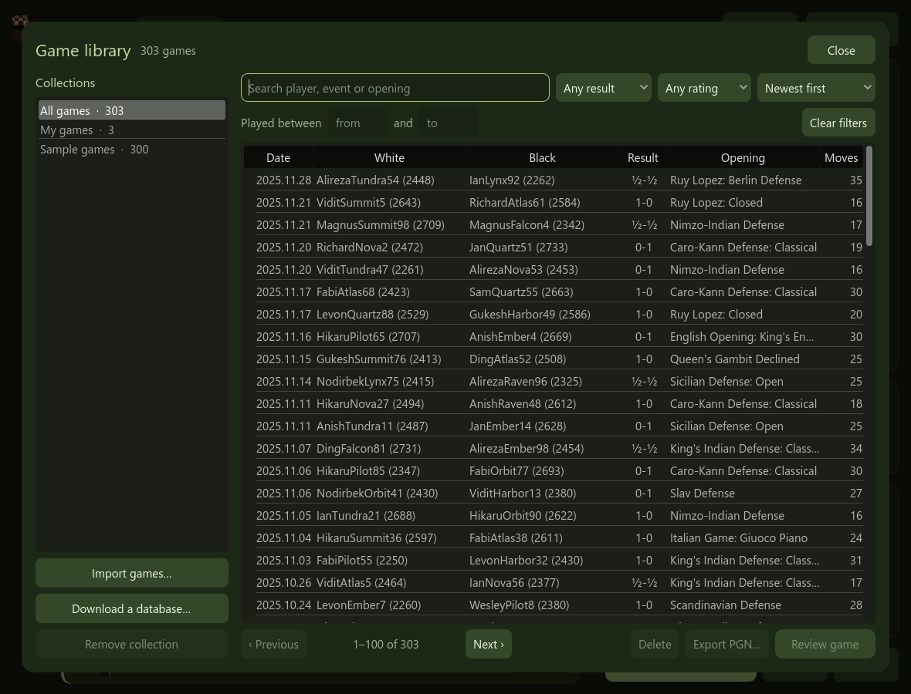
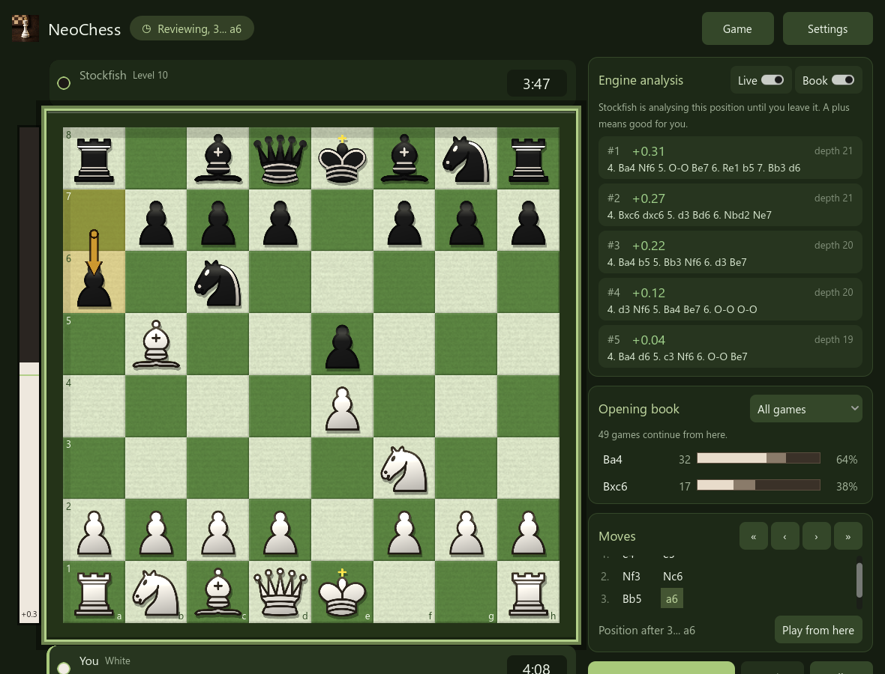

# Game library and opening book

- [The library](#the-library)
- [Searching and reviewing](#searching-and-reviewing)
- [Importing games](#importing-games)
- [Downloading a database](#downloading-a-database)
- [The opening book](#the-opening-book)
- [Importing and exporting single games](#importing-and-exporting-single-games)
- [Good to know](#good-to-know)

## The library

**Game > Game library…** (or `L`) opens your library: a local SQLite database
(`games.db` in NeoChess's [user folder](using-neochess.md#where-your-data-is-kept)).

Games live in **collections**, listed on the left:

- **My games** is filled automatically. A game is saved when it ends, and when you
  start a new game or load another one over an unfinished game (with at least
  two moves). Games you load from files are not saved again.
- Every database you import or download becomes its own collection.
- **All games** searches everything at once.

The library is built for big databases. Searches run on a background thread and
show 100 games per page (**Previous** and **Next** at the bottom), so the window
stays responsive even with half a million games.

## Searching and reviewing

Type in the search box to find a player, event or opening, and narrow it down
with the filters:

| Filter | Options |
| --- | --- |
| Result | Any result, White won, Draw, Black won |
| Rating | The stronger player's rating: any, 1800+, 2000+, 2200+, 2400+ or 2600+ |
| Played between | A range of years |
| Sort | Newest first, oldest first, highest rated, longest games |

**Clear filters** resets them. Select a game and press **Review game** (or
double-click it). The game opens in the main window, where you can step through
it with Stockfish analysing each position (see
[Reviewing a game](using-neochess.md#reviewing-a-game)).
**Export PGN…** writes the selected games to a file, and **Delete** removes them
from the library. Nothing outside the library is touched.

## Importing games

**Import games…** adds a `.pgn` file or a `.zip` of PGN files. You can also drop
them onto the window.

- The file is read on a background thread, about 4,000 games a second. You can
  keep playing, and a progress strip shows how far it is.
- **Cancel** stops the import and keeps what was added so far.
- Importing the same file twice adds nothing new. Games are recognised by their
  players, date, result and moves.
- Other chess variants (Chess960, Crazyhouse, and so on) and files that are not
  chess are skipped.
- **Remove collection** deletes an imported database from the library. The
  original file is not touched.

## Downloading a database

**Download a database…** fetches a month of the free
[Lichess Elite database](https://database.nikonoel.fr): games of strong players
on lichess.org, about 300,000 per month, released under CC0. Pick a month,
and NeoChess downloads the zip, imports it in the background as its own
collection and removes the temporary file.

The much larger [Lichess open database](https://database.lichess.org) is
published as `.pgn.zst`. Unpack it first, then use **Import games…**.

## The opening book

Switch on **Book** in the engine card and NeoChess shows what was played in your
library after the moves on the board: how many games continue from here, and for
each move how often White won, drew and lost.

- Click a move to play it (when it is your turn), or look at any position in a
  review.
- Choose one collection or all of them.
- The book follows the **order of the moves**, so a position reached by a
  different move order is a separate line.
- It covers the first 12 moves of games that start from the standard position.

A strong collection such as Lichess Elite makes a much better book than a small
one. With your own games alone the book shows your own habits.

## Importing and exporting single games

NeoChess uses the formats every chess program understands, so games move freely
between NeoChess, Lichess, Chess.com, ChessBase, Stockfish GUIs and so on.

| Format | What it is | Use it for |
| --- | --- | --- |
| **PGN** (Portable Game Notation) | A whole game: player tags, moves in algebraic notation and the result | Saving, sharing and analysing games |
| **FEN** (Forsyth-Edwards Notation) | A single position on one line | Setting up a position to play from |

The **Game** menu has:

- **Copy game (PGN)** and **Copy position (FEN)**, which put the text on the
  clipboard.
- **Save game as…**, which writes a `.pgn` file.
- **Paste game or position**, which reads the clipboard. NeoChess works out
  whether it is a PGN or a FEN.
- **Open game file…**, which reads a `.pgn`, `.fen` or `.txt` file. You can also
  drag a file onto the window.

Details:

- Exported games carry the standard seven tags (`Event`, `Site`, `Date`, `Round`,
  `White`, `Black`, `Result`). Games that did not start from the normal position
  also get `SetUp` and `FEN`, as the PGN standard asks.
- Import accepts comments, variations, `$` annotations, `0-0` style castling,
  curly quotes, a byte-order mark, Windows line endings and files with many games
  (the first game is loaded). Variations and comments are skipped, not kept.
- Only standard chess is supported. A game with another `Variant` tag, an illegal
  move or an invalid position is refused, and the message names the move.
- After an import you keep playing from the position. Against Stockfish you play
  the side that is to move.

## Good to know

- An older library is upgraded the first time a newer version opens it. If it
  holds games that an earlier build read wrongly (they show up as "moves" such
  as `Event:`), they are removed once, and a collection left empty by that
  disappears. Import the file again to get the real games.
- A library made by a *newer* NeoChess is refused rather than changed.
- The database needs `libgdsqlite.windows.template_release.x86_64.dll` next to
  `NeoChess.exe`. The release zip has it.
