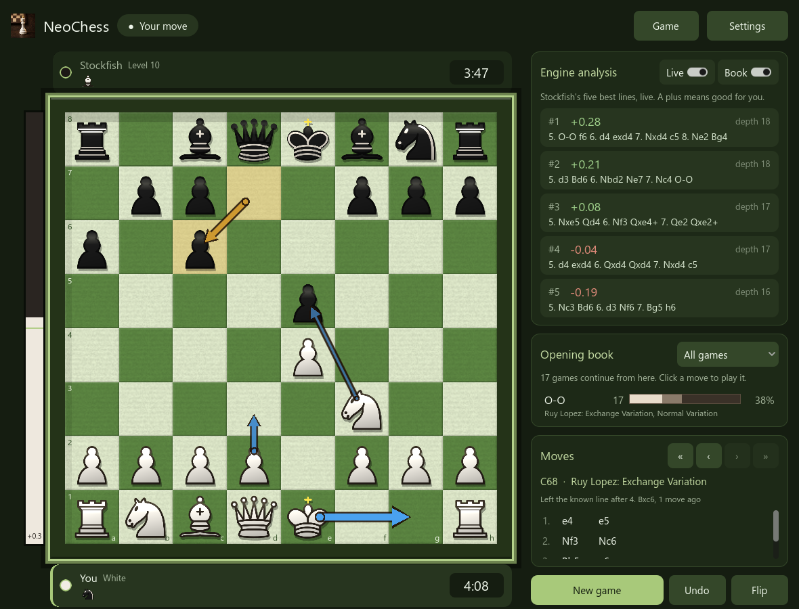
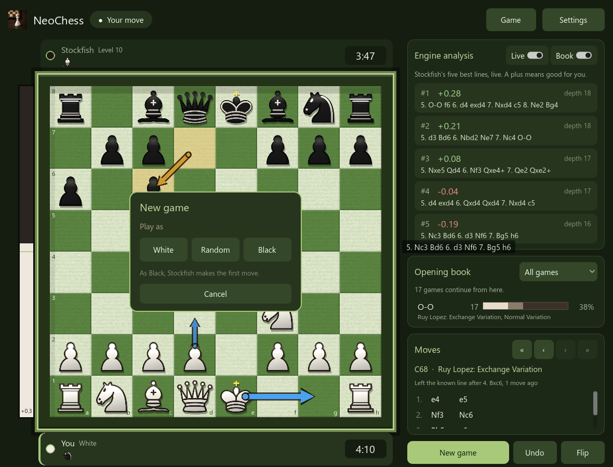
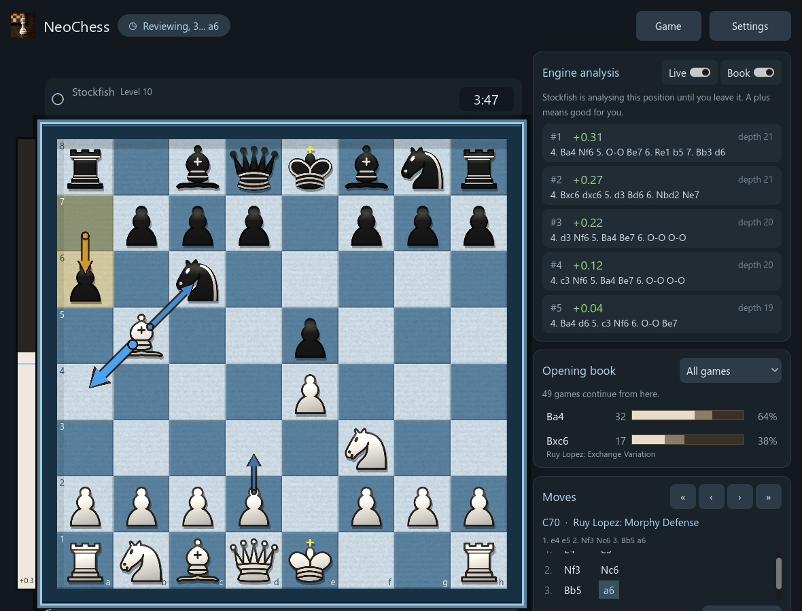
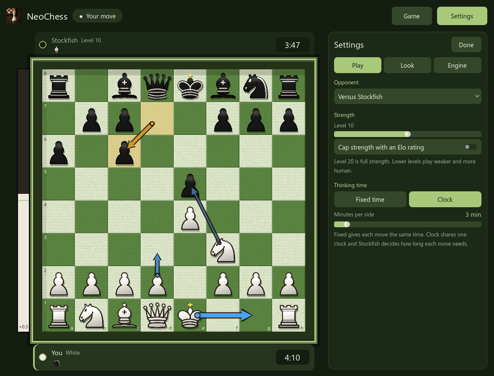
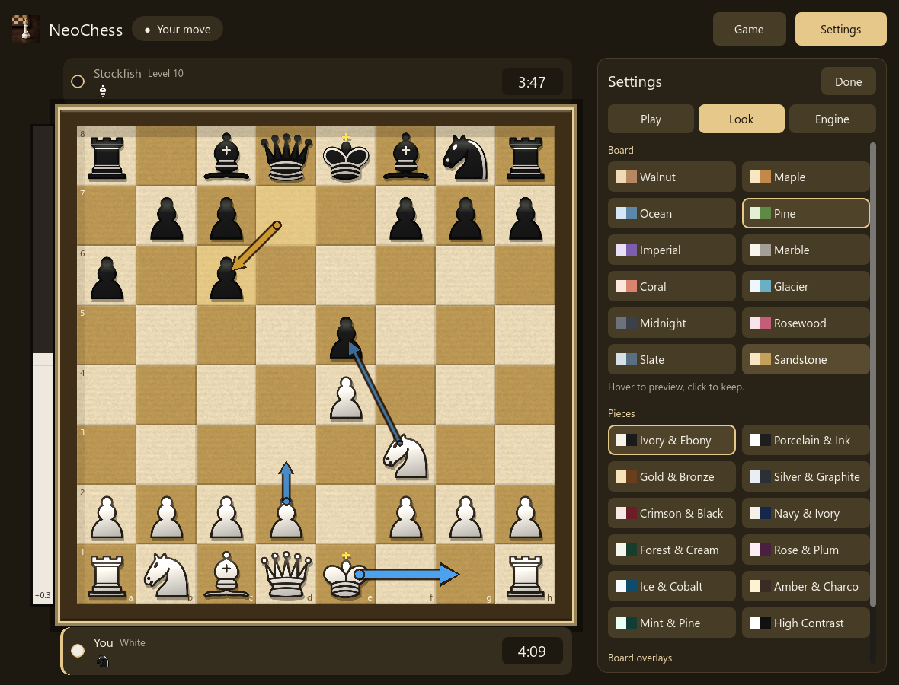
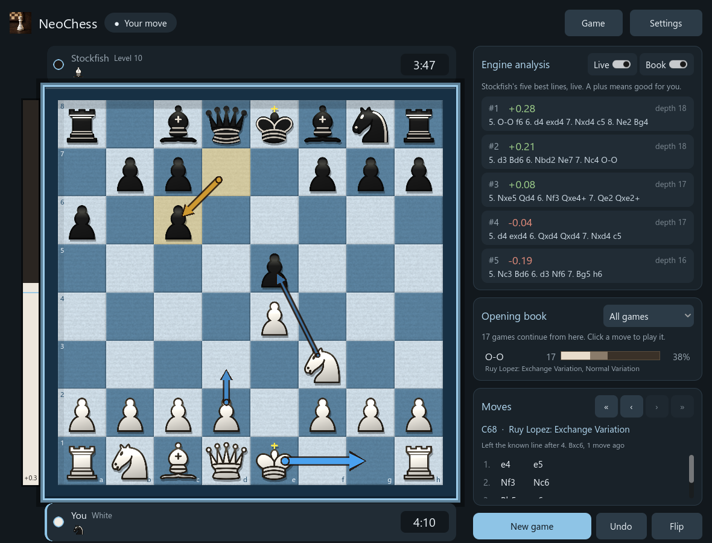

# Using NeoChess

- [Playing a game](#playing-a-game)
- [Controls](#controls)
- [Engine analysis and the Live switch](#engine-analysis-and-the-live-switch)
- [Which opening is this?](#which-opening-is-this)
- [Reviewing a game](#reviewing-a-game)
- [Settings](#settings)
- [Where your data is kept](#where-your-data-is-kept)

## Playing a game

Click a piece, then click where it goes. Legal moves are marked, and the last
move is shown with an arrow. The player strips show captured pieces and the
material lead, and the bar beside the board shows Stockfish's evaluation.

**New game** asks which side you want to play (White, Black or Random) and starts
right away. If you pick Black, Stockfish plays the first move.

How Stockfish thinks is up to you (**Settings, Play**):

- **Fixed time** gives it the same time on every move.
- **Clock** is a real chess clock of 1 to 30 minutes per side, and Stockfish
  decides how long each move needs.

Choose **Pass and play** as the opponent for two people on one computer. That
needs no engine. Switching the opponent starts a new game.

A game ends on checkmate, stalemate, threefold repetition, the fifty-move rule or
insufficient material. When it ends, or when you start a new game over an
unfinished one, it is saved to your [library](game-library.md).

## Controls

| Action | Mouse | Key |
| --- | --- | --- |
| Move a piece | Click it, then click where it goes | |
| New game (asks which side you want) | **New game** | `N` |
| Take back a move | **Undo** (against Stockfish it takes back your move and the reply) | `U` |
| Flip the board | **Flip** | `F` |
| Open or close settings | **Settings** / **Done** | `S` |
| Cancel a selection, close settings | | `Esc` |
| Look at an earlier position and analyse it | Click a move in the **Moves** list | `Left` / `Right` |
| First position, latest position | **«** and **»** under **Moves** | `Home` / `End` |
| Continue the game from the position you are viewing | **Play from here** | |
| Copy the game as PGN | **Game** > **Copy game (PGN)** | `Ctrl+C` |
| Copy the position as FEN | **Game** > **Copy position (FEN)** | `Ctrl+Shift+C` |
| Paste a game or position | **Game** > **Paste game or position** | `Ctrl+V` |
| Open the game library | **Game** > **Game library…** | `L` |

## Engine analysis and the Live switch

The **Engine analysis** card shows Stockfish's five best lines for the position
as it thinks. Each line has its score, the depth reached, and the whole
variation. The card also names the engine and shows its speed.

- A plus always means good for *you* (or for White in pass and play).
- **Live** keeps the analysis running while it is your turn, so you can watch the
  lines change. Switch it off and the engine stops. It does not run in the
  background.
- **Book** shows what the [opening book](game-library.md#the-opening-book) knows
  about the position.
- **Arrows.** The first move of Stockfish's three best lines is drawn on the board in blue: a thick arrow for the best move, a medium one for the second best and a thin one for the third. They follow the lines as they change and go away when the analysis stops. Turn them off with **Settings, Look, Best-move arrows**.

## Which opening is this?

The **Moves** card names the opening of the position on the board, with its ECO code, for example *C70 · Ruy Lopez: Morphy Defense*. Under the name you see the main line, or, if the game has left the known lines, where it did (*Left the known line after 4. Bxc6, 2 moves ago*). Click through the moves of a game and the name follows. It works by position, so the same opening is recognised after a transposition.

The names are the roughly 3,800 lines of the [Lichess chess-openings](https://github.com/lichess-org/chess-openings) data set (CC0). They also go into the game you save: your games get ECO and Opening tags, so the library can search them by opening.

## Reviewing a game

Click any move in the **Moves** list (or press `Left`) to see the position after
it. The header shows **Reviewing** and the board becomes read-only. About a third
of a second after you stop clicking, Stockfish starts analysing that position
at full strength, and its five lines and the eval bar keep going deeper until you
leave the position.

- `Left` and `Right` step through the moves, `Home` jumps to the start and `End`
  (or clicking the last move) returns to the game.
- **Live** is on while you review. Switch it off to stop the engine and clear the
  lines. Stepping to other moves then analyses nothing until you switch it on
  again, and it analyses whatever position is shown at that moment.
- **Play from here** discards the moves after the position you are viewing and
  carries on from it. Against Stockfish you play the side that is to move.
- Undo is disabled while you review. New game and importing a game also leave
  the review.

Games from your library open the same way: **Game library… > Review game**.

## Settings

Press **Settings** (or `S`). There are three pages:

| Page | What you can change |
| --- | --- |
| **Play** | Opponent (Stockfish or pass and play), strength (level 0 to 20, or cap it at an Elo), and the thinking time (fixed per move, or a chess clock) |
| **Look** | Board theme, piece set, the last-move arrow and the best-move arrows. Hover over a theme to preview it and click to keep it. |
| **Engine** | CPU threads, hash memory, move overhead and the engine file |

The whole app takes its colours from the board you pick.

## Where your data is kept

Your choices, your game library and a downloaded engine are stored in the Godot
user folder, `%APPDATA%\Godot\app_userdata\NeoChess`:

| File | What it is |
| --- | --- |
| `settings.cfg` | Your settings, saved automatically |
| `games.db` | The [game library](game-library.md) (SQLite) |
| `engine\` | A Stockfish that NeoChess downloaded for you |

Nothing is sent anywhere except the downloads you ask for. Deleting the folder
resets everything.
